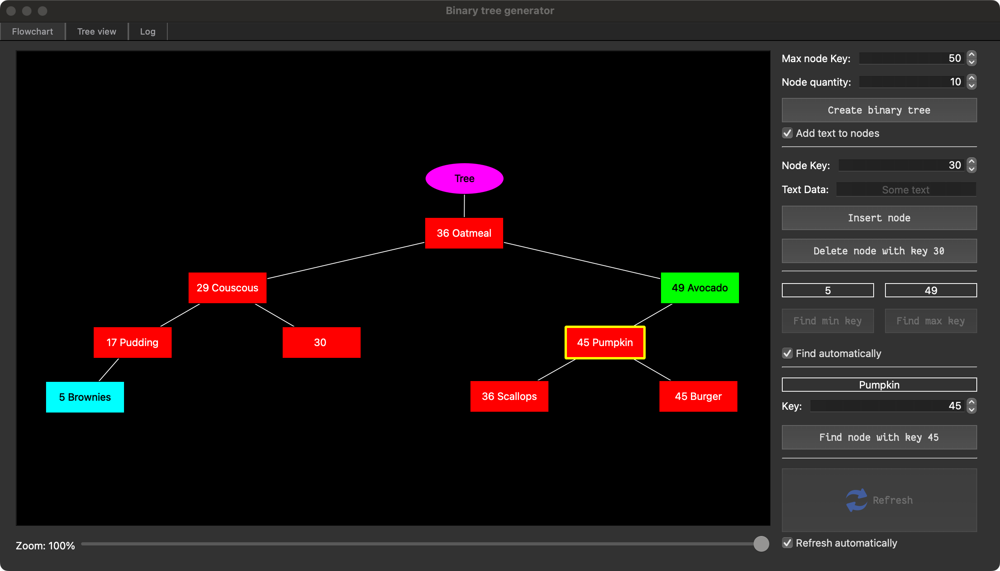
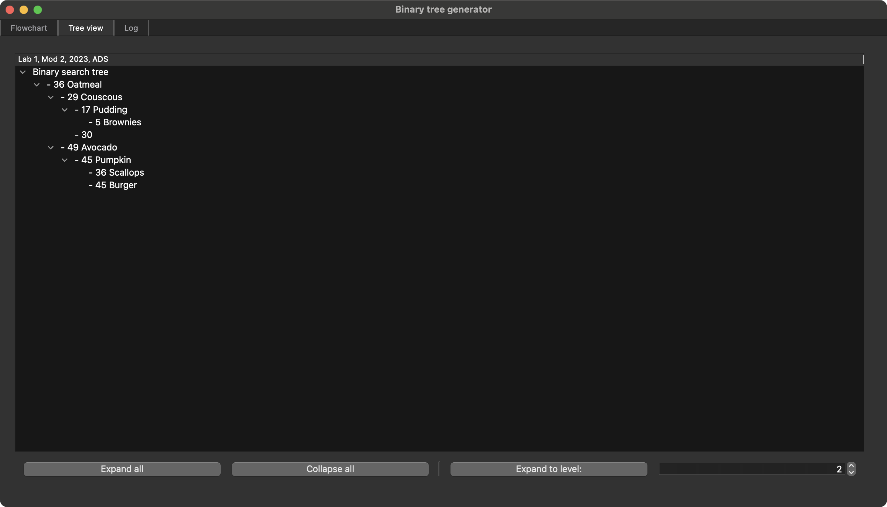

## binary tree generator

This app is written in `C++` with `Qt`. You can see the source code for binary
trees in
[`bintree.h`](https://github.com/Dolfost/binary-tree-generator/blob/main/bintree.h).

## Caveats
App has incomplete tree drawing algorithm. If you can write one that takes
the tree root pointer and sets it's `rightSpacing`, `leftSpacing`,
`rightCummulativeSpacing` and `leftCummulativeSpacing`, I would like to see You in contributors list.
